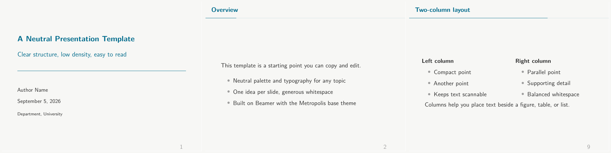

# Neutral Beamer Template

A neutral, readable Quarto format extension for PDF slide decks. No logos, no branding, no topic-specific styling. Use it for teaching, research talks, internal reviews, or any presentation where clarity matters.



## What it is

A Quarto format extension that renders Beamer PDF slides with the Metropolis base theme, tuned for readability:

- **Neutral palette.** Off-white canvas, dark-gray text, teal structure, terracotta alerts. Body text meets WCAG AAA (13.0:1). Structure (5.6:1) and alert (5.1:1) meet WCAG AA for normal text and AAA for large text.
- **Readable typography.** Source Sans for body and titles, Source Code Pro for monospace. Body text stays at 11pt with 1.5 line spacing. Nested lists do not shrink.
- **Low visual weight.** No navigation symbols, circle bullets in light gray, transparent blocks with teal titles, minimal right-aligned slide numbers.
- **Simple geometry.** 4:3 by default, 10mm side margins, one idea per slide.

## Requirements

- **Quarto** 1.4 or newer.
- **TeX Live** with `xelatex` (default), `beamertheme-metropolis`, `fontspec`, `sourcesanspro`, and `sourcecodepro`.

No internet connection is needed at render time. The template uses system font lookup with Latin Modern Sans and Latin Modern Mono as fallbacks if Source Sans 3 and Source Code Pro are not installed.

## Quick start

Clone this repository:

```bash
git clone git@github.com:harrizsb/presentation-template.git
cd presentation-template
quarto render template.qmd
```

The output is `template.pdf` in the same folder.

To use the format in your own project, copy the `_extensions/neutral/` folder next to your `.qmd` and set:

```yaml
---
title: "My talk"
format: neutral-beamer
---
```

To make `neutral-beamer` the default for every `.qmd` in a project, add this to `_quarto.yml`:

```yaml
project:
  type: default

format: neutral-beamer
```

Any `.qmd` in that project without an explicit `format` field will use `neutral-beamer`.

Note: `quarto add <org>/<repo>` does not work with private repositories because it clones over unauthenticated HTTPS. For a private repo, use `git clone` over SSH as shown above, then copy `_extensions/neutral/` into your project.

## Options

Set options under `format.neutral-beamer` in your YAML front matter. The extension declares these defaults in `_extensions/neutral/_extension.yml`:

| Option | Default | Values | Description |
|--------|---------|--------|-------------|
| `theme` | `metropolis` | any Beamer theme name | Base Beamer theme. Metropolis options (progress bar, regular title format, transparent blocks, section-page progress bar) are applied conditionally in `header.tex`. A user override like `madrid` is safe: the guard skips the metropolis-only options. |
| `aspectratio` | `43` | `43`, `169`, `1610`, `149`, `141`, `54`, `32` | Slide aspect ratio. Use `169` for widescreen. Pass as a bare number, not a quoted string. |
| `fontsize` | `11pt` | `8pt` to `20pt` | Beamer body text size. |
| `section-titles` | `true` | `true`, `false` | Render `#` headings as section pages. |
| `numbersections` | `true` | `true`, `false` | Number section pages. |
| `navigation` | `empty` | `empty`, `horizontal`, `vertical`, `fixed` | Beamer navigation symbols. `empty` hides them entirely. |
| `pdf-engine` | `xelatex` | `xelatex`, `lualatex`, `pdflatex` | LaTeX engine. See the Fonts section for the difference between XeLaTeX and pdfLaTeX. |

Standard Quarto Beamer options (`toc`, `slide-level`, `incremental`) work alongside these. The progress bar style, title format, transparent blocks, color palette, and font families are baked into `_extensions/neutral/header.tex` and are not exposed as YAML options.

Example with the widescreen switch:

```yaml
---
format:
  neutral-beamer:
    aspectratio: 169
    fontsize: 12pt
    toc: true
---
```

## Colors

The palette is fixed for consistency. Change it only by editing `_extensions/neutral/header.tex`.

| Element | Color | Hex | Contrast on background |
|---------|-------|-----|------------------------|
| Background | Off-white | `#F7F7F5` | n/a |
| Body text | Dark gray | `#2C2C2C` | 13.0:1 (WCAG AAA) |
| Structure, block titles, section pages | Teal | `#006B8C` | 5.6:1 (AA normal, AAA large) |
| Alerted text | Terracotta | `#B84300` | 5.1:1 (AA normal, AAA large) |
| Bullets, rules, slide numbers | Light gray | `#9E9E9E` | 2.5:1 (decorative elements only, not body text) |

Alerts render bold in terracotta. Emphasis never relies on color alone.

## Fonts

- **XeLaTeX** (default, `pdf-engine: xelatex`): `fontspec` loads Source Sans 3 for text and Source Code Pro for monospace, with Latin Modern Sans and Latin Modern Mono as fallbacks when the fonts are not installed.
- **pdfLaTeX** (`pdf-engine: pdflatex`): the `sourcesanspro` and `sourcecodepro` LaTeX packages, which bundle the fonts.

No internet-only fonts are used. All fonts ship with TeX Live.

## Authoring tips

- One idea per slide. Split a dense slide into two.
- Keep bullet lists to three to five items.
- Use `#` for section pages and `##` for slides.
- Use `::: {.columns}` and `::: {.column}` for side-by-side content.
- Mark key terms with `[term]{.alert}` for bold terracotta text.
- Put speaker notes in `::: {.notes}` blocks. They do not appear on slides.
- For code you do not need to execute, use a fenced code block. Executable cells with `#| echo: true` and `#| eval: true` require a Python (Jupyter) kernel.

## brand.yml

`brand.yml` is **not** auto-applied to Beamer output in this template. Quarto applies `brand.yml` to HTML formats, but the Beamer path does not read it. Colors and fonts are set in the extension's LaTeX files. If you need different colors or fonts, edit `_extensions/neutral/header.tex`.

## Documentation

Full guides live in the `docs/` folder:

| Guide | Contents |
|-------|----------|
| [Getting started](docs/getting-started.md) | Requirements, installation, minimal example, demo tour |
| [Format options](docs/format-options.md) | Every option, merge semantics, override recipes |
| [Authoring guide](docs/authoring-guide.md) | Slides, lists, callouts, columns, tables, code, math, notes |
| [Customization](docs/customization.md) | Palette, fonts, spacing, footer, theme override |
| [Troubleshooting](docs/troubleshooting.md) | Debugging, known issues, error catalog |

## Files

| File | Purpose |
|------|---------|
| `template.qmd` | Demo deck and starter file. Copy it to begin. |
| `template.pdf` | Rendered preview of `template.qmd`. |
| `_extensions/neutral/` | The format extension. Keep it next to your `.qmd`. |
| `docs/` | Full documentation (getting started, options, authoring, customization, troubleshooting). |
| `docs/preview.png` | Preview image shown at the top of this README. |
| `_quarto.yml` | Optional project defaults. |
| `README.md` | This overview. |
